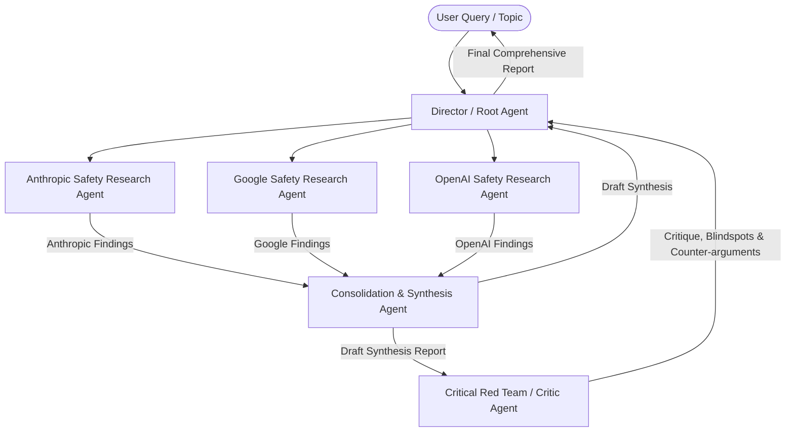

# AI Safety Policy Multi-Agent Comparison System

Design and scaffold a multi-agent system built with ADK to analyze, compare, and debate AI safety policies from Anthropic, Google, and OpenAI.

## System Architecture & Multi-Agent Flow

The system will use a hierarchical, multi-agent architecture leveraging ADK `Agent` delegates.



### Agent Roles & Responsibilities

1. **Anthropic Safety Research Agent (`anthropic_research_agent`)**
   - **Focus**: Responsible AI Framework, Frontier Risk Commitments, RSP (Responsible Scaling Policy), constitutional AI safety guidelines, alignment testing.
   - **Tools**: Web search / Policy retrieval tool.

2. **Google Safety Research Agent (`google_research_agent`)**
   - **Focus**: Google AI Principles, Frontier Model Safety Commitments, Secure AI Framework (SAIF), red-teaming practices, evaluation benchmarks.
   - **Tools**: Web search / Policy retrieval tool.

3. **OpenAI Safety Research Agent (`openai_research_agent`)**
   - **Focus**: Preparedness Framework, Safety & Security Committee disclosures, Model Spec, Risk Categories (CBRN, CBRN capability tracking), alignment practices.
   - **Tools**: Web search / Policy retrieval tool.

4. **Consolidation & Synthesis Agent (`synthesis_agent`)**
   - **Focus**: Compares key dimensions across company policies:
     - Risk Thresholds & Trigger Criteria (e.g., when model training/deployment is paused or audited)
     - Governance & Oversight Structures (external vs. internal advisory boards)
     - Red-teaming & Pre-deployment Evaluation Standards
     - Transparency & Open Disclosures
   - **Output**: A structured comparative matrix and side-by-side synthesis.

5. **Critic / Red Team Agent (`critic_agent`)**
   - **Focus**: Stress-tests the synthesis findings. Identifies:
     - Vague or non-binding policy language
     - Blindspots (e.g., lack of enforcement mechanisms, self-regulation bias)
     - Marketing / PR gloss vs. technical guarantees
     - Unaddressed emerging risks (e.g., autonomous replication, cyber capability thresholds)

6. **Director Agent (`root_agent`)**
   - **Focus**: Orchestrates the multi-agent workflow, aggregates sub-agent responses, and formats the final executive comparison report with the critic's points incorporated.

---

## User Review Required

> [!IMPORTANT]
> The system utilizes simulated ground-truth data tools for policy benchmarks alongside dynamic Google Web Search tools so it can run reliably offline or live.

---

## Proposed Changes

### [`simple-agent/app/agent.py`](file:///config/Desktop/BuildWithGemini/simple-agent/app/agent.py)

#### [MODIFY] [agent.py](file:///config/Desktop/BuildWithGemini/simple-agent/app/agent.py)
- Refactor `app/agent.py` to define the 5 sub-agents (`anthropic_research_agent`, `google_research_agent`, `openai_research_agent`, `synthesis_agent`, `critic_agent`).
- Configure `root_agent` with sub-agents and orchestrating instructions.
- Add research helper tools for fetching/searching AI safety policy commitments.

---

## Verification Plan

### Automated Tests
- Test sub-agent instantiation and workflow execution using ADK runner:
  ```bash
  uv run adk run app "Compare AI safety commitments and risk thresholds between Google, Anthropic, and OpenAI."
  ```

### Manual Verification
- Access the Web Playground at [http://localhost:8080](http://localhost:8080) to inspect tool calls, sub-agent delegation, and agent-to-agent message passing.
